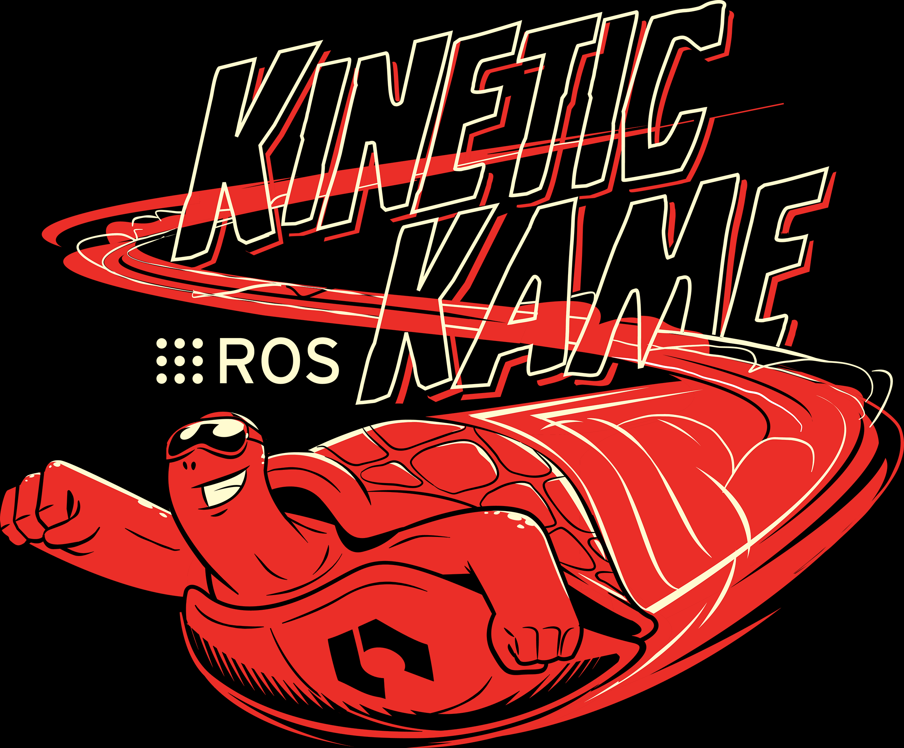
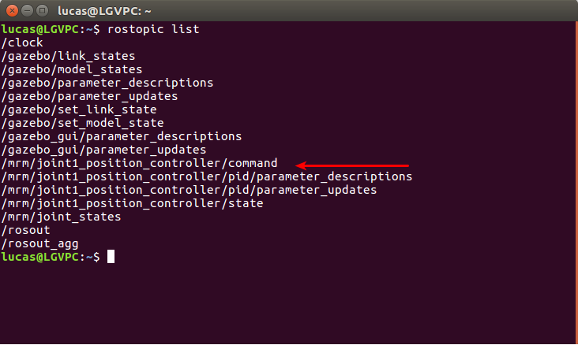

 Instalación y Getting Started

## Acerca de [ROS](https://www.ros.org/about-ros/)
---
El sistema operativo de los robots (ROS) es un framework flexible para escribir software de robótica. Es una colección de herramientas, librerias, y convenciones que apuntan a simplificar la tarea de crear complejos y robustos comportamientos robóticos en una amplia variedad de plataformas robóticas.

### Antes de empezar (recomendado)
[Preparar vscode](/vscode.md)

## Empezando 
---
### Instalación ([Kinetic KAME](http://wiki.ros.org/kinetic))
<br>
<center></center>
<br>
ROS Kinetic <strong>Solo soporta</strong> Wily (Ubuntu 15.10), Xenial (Ubuntu 16.04) and Jessie (Debian 8).
<br><br>
1. Preparar lista de paquetes.

    sudo sh -c 'echo "deb http://packages.ros.org/ros/ubuntu $(lsb_release -sc) main" > /etc/apt/sources.list.d/ros-latest.list'
<br>
2. Añadir llave de seguridad.

    sudo apt-key adv --keyserver 'hkp://keyserver.ubuntu.com:80' --recv-key C1CF6E31E6BADE8868B172B4F42ED6FBAB17C654
<br>
3. Actualizar lista de paquetes
    
    sudo apt-get update
<br>
4. Instalación. <strong>Desktop FULL</strong> instalación recomendada : ROS, rqt, rviz, robot-generic libraries, 2D/3D simulators, navigation and 2D/3D perception.

    sudo apt-get install ros-kinetic-desktop-full
<br>
5. Peparar entorno

    echo "source /opt/ros/kinetic/setup.bash" >> ~/.bashrc
    
    source ~/.bashrc
<br>
6. Para usuarios zsh

    echo "source /opt/ros/kinetic/setup.zsh" >> ~/.zshrc
    source ~/.zshrc
<br>
7. Dependencias para creación de paquetes

    sudo apt install python-rosdep python-rosinstall python-rosinstall-generator python-wstool build-essential
<br>
1. Inicializar Rosdep

    sudo apt install python-rosdep
    sudo rosdep init
    rosdep update

## Creando un [ROS Workspace](http://wiki.ros.org/ROS/Tutorials/InstallingandConfiguringROSEnvironment)

    mkdir -p ~/catkin_ws/src
    cd ~/catkin_ws/
    catkin_make
    source devel/setup.bash 

Podemos agregar la última linea(source devel/setup.bash) a nuestro archivo ~/.bashrc.

Recomiendo visitar y leer esta [página](http://wiki.ros.org/ROS/Tutorials/NavigatingTheFilesystem) para estar familiarizado con la estructura de un proyecto de ROS.

## Creamos un [Paquete](http://wiki.ros.org/ROS/Tutorials/CreatingPackage)
---
catkin_create_pkg requiere que se le dé un nombre_paquete y, opcionalmente, una lista de dependencias de las que depende ese paquete:

    # Este es un ejemplo, no intente correrlo
    # catkin_create_pkg <nombre_paquete> [depend1] [depend2] [depend3]

Creamos nuestro primer paquete: asegurese de cambiar el nombre del paquete:

    cd ~/catkin_ws/src
    catkin_create_pkg nombre_del_paquete std_msgs rospy roscpp
    cd ~/catkin_ws
    catkin_make
    source ~/catkin_ws/devel/setup.bash

##  ROS [Node](http://wiki.ros.org/rospy/Overview/Initialization%20and%20Shutdown), ROS [Topic](http://wiki.ros.org/Topics). ROS [Launch](http://wiki.ros.org/roslaunch), ROS [run](http://wiki.ros.org/rosbash#rosrun)
---


- ROS NODE y ROS Topics

De manera simplificada, un nodo ROS es un programa ejecutandose en el momento preparado para interactuar con ROS, su comando es [rosnode](http://wiki.ros.org/rosnode). Un topico es la manera en la que se comunican dos nodos de ROS, su comando en la terminal es [rostopic](http://wiki.ros.org/rostopic).

- ROS Launch y ROS run
  
De manera simplificada, con ROS Launch ejecutamos un archivo .launch el cual tiene la capacidad de iniciar varios Nodos a la vez, ademas de establecer parámetros con los que se van a trabajar.
<br>

## Creando nuestro primer robot manipulador
---
Creamos el paquete:

    cd ~/catkin_ws/src

    catkin_create_pkg my_manipulator_description rospy rviz gazebo_ros joint_state_publisher robot_state_publisher

Una vez creado el paquete, creamos la estructura del proyecto:

    cd ~/catkin_ws/src/my_mira_description
    mkdir launch
    mkdir models
    mkdir rviz_config
    mkdir config
    mkdir urdf
    mkdir worlds

    cd /home/user/catkin_ws/src;rospack profile

Un manipulador simple, consiste de eslabones ([Links](http://wiki.ros.org/urdf/XML/link)) y junturas ([Joints](http://wiki.ros.org/urdf/XML/joint)):
 

Debemos entonces escribir la descripción del robot en terminos de juntutas y enlaces. Debemos tener en cuenta que Gazebo es un simulador de fisicas por lo será necesario definir a estas junturas y enlaces algunas propiedades fisicas para que el robot no esté hecho de aire y no traspace paredes.

Esta descripción debe estar en un archivo `.urdf`

Creamos entonces nuestro primer manipulador simple, para eso creamos el archivo `mrm.urdf` dentro de nuestra carpeta urdf:

    roscd my_manipulator_description
    touch urdf/mrm.urdf

En el copiamos el siguiente archivo [mrm.urdf](./urdf/mrm.urdf), de ese archivo vemos como se compone de dos eslabones y una juntura.

La primera juntura se llama `base_link`, comparemos con la que aparece en la documentación:

<table style="width:100%">
    <tr>
        <th style="text-align:center"> Nuestra Juntura</th>
        <th style="text-align:center"> Juntura de la Documentación</th>
    </tr>
    <tr>
        <td>

```xml
<link name="base_link">

        <inertial>
            <origin xyz="0.0 0.0 0.0" rpy="0.0 0.0 0.0"/>
            <mass value="1024"/>
            <inertia ixx="170.6" ixy="0.0" ixz="0.0" iyy="170.6" iyz="0.0" izz="170.6"/>
        </inertial>
        
        <visual>
            <origin rpy="0 0 0" xyz="0 0 0"/>
            <geometry>
                <box size="1.4 1.4 0.6"/>
            </geometry>
            <material name="cyan">
                <color rgba="0 1.0 1.0 1.0"/>
            </material>
        </visual>

        <collision>
            <origin xyz="0.0 0.0 0.0" rpy="0.0 0.0 0.0"/>
            <geometry>
                <box size="1.4 1.4 0.6"/>
            </geometry>
        </collision>

    </link>
```
</td>
<td >

```xml

 <link name="my_link">

   <inertial>
     <origin xyz="0 0 0.5" rpy="0 0 0"/>
     <mass value="1"/>
     <inertia ixx="100.0"  ixy="0"  ixz="0" iyy="100.0" iyz="0" izz="100.0" />
   </inertial>

   <visual>
     <origin xyz="0 0 0" rpy="0 0 0" />
     <geometry>
       <box size="1 1 1" />
     </geometry>
     <material name="Cyan">
       <color rgba="0 1.0 1.0 1.0"/>
     </material>
   </visual>

   <collision>
     <origin xyz="0 0 0" rpy="0 0 0"/>
     <geometry>
       <cylinder radius="1" length="0.5"/>
     </geometry>
   </collision>

 </link>
```
</td>
</tr>
</table>
<mark style="background-color: green; color: white">Código del archivo mrm.urdf linea 5-29</mark>
<br><br>

De igual manera podemos comparar la juntura con la que aparece en la documentación:

<table style="width:100%">
    <tr>
        <th style="text-align:center"> Nuestra Juntura</th>
        <th style="text-align:center"> Juntura De la Documentación</th>
    </tr>
    <tr>
        <td>

```xml
<joint name="base_link__link_01" type="revolute">
    <origin rpy="0 0 0" xyz="0 0 0.5"/>
    <parent link="base_link"/>
    <child link="link1"/>

    -- <calibration rising="0.0"/>
    -- <dynamics damping="0.0" friction="0.0"/>
    <limit effort="1000.0" lower="-3.14" upper="3.14" velocity="0.5" />
    -- <safety_controller k_velocity="10" k_position="15" soft_lower_limit="-2.0" soft_upper_limit="0.5" />
    <axis xyz="0 0 1" />
</joint>
```
</td>
<td >

```xml
  <joint name="my_joint" type="floating">
    <origin xyz="0 0 1" rpy="0 0 3.1416"/>
    <parent link="link1"/>
    <child link="link2"/>

    <calibration rising="0.0"/>
    <dynamics damping="0.0" friction="0.0"/>
    <limit effort="30" velocity="1.0" lower="-2.2" upper="0.7" />
    <safety_controller k_velocity="10" k_position="15" soft_lower_limit="-2.0" soft_upper_limit="0.5" />
    -- <axis xyz="0 0 1" />
 </joint>
```
</td>
</tr>
</table>

Es importante tambien entender la syntaxis de los archivos urdf y la composición de un [robot](http://wiki.ros.org/urdf/XML/robot) para entender las etiquetas y sus parámetros.

Observaciones:
- Unidades en SI (Metros, radianes, kilogramos)
- Existen 3 figuras básicas que se pueden utilizar: box, cylinder, sphere
- Las unidades de masa deben ser coherentes a la vez que los momentos de inercia. adjunto está un script de python con un calculador de inercias. [Click Aquí](/Inercias.md)

Ejemplos
```xml
<cylinder radius="0.06" length="0.09"/>
<box size="0.0005 0.0005 0.0005"/> x-length,y-legth and z-length
<sphere radius="0.06"/>
```

Ahora que creamos el primer robot, lo que haremos a continuación es "lanzarlo" a travez de roslaunch y probar que los movimientos de las junturas son los deseados, para esto, es necesario entonces crear el archivo `.launch` respectivo en donde utilizaremos la herramienta rviz para ver cómo se ve el modelo, en este caso lo llamarermos rviz_urdf_visualize.launch

    cd /home/user/catkin_ws/src
    roscd my_mira_description
    touch launch/rviz_urdf_visualize.launch

En este archivo copiamos los siguiente:
```xml
<launch>

  <!-- USE: roslaunch my_mira_description urdf_visualize.launch model:='$(find myrobot_package)/urdf/myrobot.urdf' -->
  <arg name="model" default=""/>


  <param name="robot_description" command="cat $(arg model)" />

  <!-- send fake joint values -->
  <node name="joint_state_publisher" pkg="joint_state_publisher" type="joint_state_publisher">
    <param name="use_gui" value="TRUE"/>
  </node>

  
  <!-- Combine joint values -->
  <node name="robot_state_publisher" pkg="robot_state_publisher" type="state_publisher"/>

  <!-- Show in Rviz   -->
  <!--<node name="rviz" pkg="rviz" type="rviz" args="-d $(find my_mira_description)/rviz_config/urdf.rviz"/>-->
  <node name="rviz" pkg="rviz" type="rviz" args=""/>

</launch>
```
<mark style="background-color: green; color: white">Código del archivo rviz_urdf_visualize.launch</mark>

Para ver nuestro modelo en `rviz` procedemos a "lanzarlo"

    roslaunch my_manipulator_description rviz_urdf_visualize.launch model:='$(find my_manipulator_description)/urdf/mrm.urdf'

Para entender cómo se compone este archivo dar [click aquí](urdf_visualize_composition.md)
<br><br>

### Visualizar nuestro manipulador en [Gazebo](http://gazebosim.org)
---
Para visualizar nuestro robot en el simulador gazebo, debemos realizar una serie de pasos complementarios a los anteriores. Si se fijaron, en el archivo [mrm.udf](urdf/mrm.urdf) en la linea 62 - 72 está el siguiente fragmento:

```xml
<transmission name="trans_base_link__link_01">
    <type>transmission_interface/SimpleTransmission</type>
    <joint name="base_link__link_01">
        <hardwareInterface>hardware_interface/EffortJointInterface</hardwareInterface>
    </joint>

    <actuator name="motor_base_link__link_01">
        <hardwareInterface>hardware_interface/EffortJointInterface</hardwareInterface>
        <mechanicalReduction>1</mechanicalReduction>
    </actuator>
</transmission>
```
<mark style="background-color: green; color: white">Código del archivo mrm.urdf linea 62-72</mark>

Este fragmento debemos agregarlo para cada juntura que queramos móvil y tener control sobre ella. con esta, se configura de manera que gazebo la trate como un servomotor.

Lo siguiente es crear un archivo de configuración que será el encargado de definir el controlador con el que se va a manejar los "servmotores", para esto, creamos un archivo `.yaml` llamado `joints.yaml`

    roscd my_manipulator_descripction
    touch config/joints.yaml

En el copiamos lo siguiente:
```yaml
# Publish all joint states -----------------------------------
joint_state_controller:
  type: joint_state_controller/JointStateController
  publish_rate: 50

# Position Controllers ---------------------------------------
joint1_position_controller:
  type: effort_controllers/JointPositionController
  joint: base_link__link_01
  pid: {p: 2000.0, i: 100, d: 500.0}
```

Notese las variables del PID estas son importantes debido a que con las incorrectas podemos desestabilizar nuestro sistema. Para cada motor es necesario entonces definirlo en este archivo siguiendo la misma estrctura. Nótese que el atributo `joint` debe coincidir con el nombre de la juntura a la cual se le está definiendo el controlador.

A cada Link del robot es posible agregar una etiqueta `gazebo` con la cual podemos agregar entre otras cosas un material para decorar nuestro modelo en caso de que no se hayan agregado texturas. Un ejemplo se ve en el archivo mrm.urdf en las lineas 31 - 33 y en las lineas 82 - 84. para tener una lista mas completa de los materiales que se pueden agregar visitar [Gazebo Materials](http://wiki.ros.org/simulator_gazebo/Tutorials/ListOfMaterials)

Por último, es necesario crear otro archivo `.launch` que se encargue de "lanzar" y poner todo a funcionar:

    roscd my_manipulator_description
    touch launch/gazebo_urdf_visualize.launch

En el ponemos lo siguiente:

```xml
<?xml version="1.0" encoding="UTF-8"?>
<launch>
    
    <group ns="/mrm">
        
        <!-- Robot model -->
        <param name="robot_description" command="cat $(find my_manipulator_description)/urdf/mrm.urdf" />
        <arg name="x" default="0"/>
        <arg name="y" default="0"/>
        <arg name="z" default="0.5"/>

        <!-- Spawn the robot model -->
        <node name="mybot_spawn" pkg="gazebo_ros" type="spawn_model" output="screen"
              args="-urdf -param robot_description -model mrm -x $(arg x) -y $(arg y) -z $(arg z)" />

        <!-- Load controllers -->
        <rosparam command="load" file="$(find my_manipulator_description)/config/joints.yaml" />
        
        <!-- Controllers -->
        <node name="controller_spawner" pkg="controller_manager" type="spawner"
            respawn="false" output="screen" ns="/mrm"
            args="--namespace=/mrm
            joint_state_controller
            joint1_position_controller
            --timeout 60">
        </node>

        <!-- rqt uncomment the line below to launch rqt_gui-->
        <!--node name="rqt_publisher" pkg="rqt_publisher" type="rqt_publisher" / -->
    
    </group>
          
</launch>
```

<mark style="background-color: #F08080; color: white">En los argumentos del nodo que lanza los controladores es necesario poner todos los controladores definidos en el archivo `joints.yaml`<mark> 

Para visusalizar entonces nuestro modelo, incializamos gazebo. Para esto, escribimos lo siguiente en una terminal:

    roslaunch gazebo_ros empty_world.launch

y en otra terminal, lanzamos nuestro archivo `gazebo_urdf_visualize.launch`, en otra terminal escribimos lo siguiente:

    roslaunch my_manipulator_description gazebo_urdf_visualize.launch

Si vemos la lista de topicos hasta este momento: (en otra terminal escrbimos lo siguiente)

    rostopic list

Deberia aparecer una listar con los topicos disponibles como muestra la siguiente figura:



El topico que nos interesa es el mostrado en la figura, `/mrm/joint1_position_controller/command`, por medio de este topico podemos interactuar con nuestro robot de la siguiente manera:

    rostopic pub /mrm/joint1_position_controller/command std_msgs/Float64 "data: 3.0"

Debería verse algo como esto:


Ahora estamos listos para interactuar con nuestro robot por medio de un script y ejecurarlo con el comando `rosrun`, para esto nuestro archivo de python llamando `demo_mrm.py`:

    roscd my_manipulator_description
    touch src/demo_mrm.py

En este archivo copiamos el archivo [demo_mrm.py](src/demo_mrm.py). Este archivo crea un nodo llamado ` joint_mover` en la linea 14:
```python
rospy.init_node('joint_mover', anonymous=True)
```
y a su vez crea un `publisher` el cual se encarga de enviar mensajes al tópico `/mrm/joint1_position_controller/command`, esto lo vemos en las lineas 16, 17:
```python
joint_mover_topic_name = '/mrm/joint1_position_controller/command'
move_base = rospy.Publisher(joint_mover_topic_name, Float64, queue_size=1)
``` 
El resto del programa es lógica para entrar en un bucle y pedir angulos a los cuales la base irá, para cerrar basta con ingresar la letra `Q`.

Para publicar el valor ingresado, se le dice al `Publisher` Creado que envíe los datos en forma de `Float64`, esto lo vemos en la linea 34:
```python
# Topic es el *Publisher* creado, fue pasado como parametro a la funcion loop
topic.publish(angulo)
```
Para saber que tipo de mensaje debemos enviar, basta con pedir información de la composición del mensaje del topico en cuestión, para eso corremos el siguiente comando en la terminal:

    rostopic info /mrm/joint1_position_controller/command

lo cual nos saca la siguiente salida:


Vemos que el tipo de mensaje es `std_msgs/Float64`, es por esto que en la linea 4 importamos ese tipo de mensajes de una de las librerias que viene con la instalación de ros:
```python
from std_msgs.msg import Float64
```

y para saber como se conforma este tipo de mensajes, basta con pedir información al mensaje desde la consola con el siguiente comando:

    rosmsg show std_msgs/Float64

lo cual nos saca la siguiente salida:


es por esto que en la linea 32 llenamos el parametro `data` de la variable `angulo` como se muestran en las lineas 22:

```python
# Definición de la variable angulo tipo Float64
angulo = Float64()
```
y la linea 32:
```python
# float(entrada) convierte la -entrada-(string) en tipo flotante
angulo.data = float(entrada)
```
de igual forma podemos ver esto directamente en la [documentación](http://docs.ros.org/en/jade/api/std_msgs/html/msg/Float64.html)

### Terminando nuestro Manipulador
En este documento aprendimos las bases de

## Recursos.

- [My Robotic Manipulator](https://www.youtube.com/watch?v=Ale55LcdZeE&list=PLK0b4e05LnzYpDnNeWJcQLju7JfJFX-lk&index=1&pbjreload=101) - Este turorial video por [The Construct](https://www.youtube.com/channel/UCt6Lag-vv25fTX3e11mVY1Q)
- [rospy](http://docs.ros.org/en/jade/api/rospy/html/rospy-module.html#on_shutdown) - Documentación libreria rospy
- [Código](https://bitbucket.org/theconstructcore/my-robotic-manipulator/src/master/) - del proyecto completado.
- [Cursos](https://www.theconstructsim.com) - The construct
- [ROS Online](https://app.theconstructsim.com/#/Rosjects) - Para utiliar ROS en el navegador.
- [SolidWorks to URDF](https://www.youtube.com/watch?v=BpOeQsPOAXg) - Como exportar desde solidworks a URDF